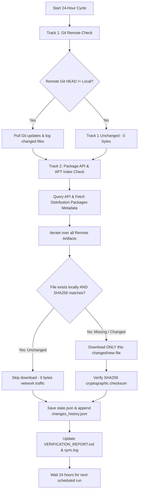

# 24-Hour Differential Change Detection & Sync Workflow

This workflow checks for upstream updates every 24 hours across **Track 1** (Git commits) and **Track 2** (Codeberg Package API releases), and **downloads only the files that have changed or are newly added**.

---

## Differential Change Detection Architecture



---

## Core Components

| File | Purpose |
| :--- | :--- |
| [`pnetlab_daily_change_sync.py`](file:///e:/Git/EMULATOR/0-P-UNTOUCHED/pnetlab_daily_change_sync.py) | **Differential Engine**: Queries remote API, verifies SHA256 hashes, downloads ONLY new/changed files, maintains `state.json` and `changes_history.json`. |
| [`setup_windows_scheduler.ps1`](file:///e:/Git/EMULATOR/0-P-UNTOUCHED/setup_windows_scheduler.ps1) | **Scheduler Setup**: Registers a native Windows Scheduled Task (`PNetLab-24h-Sync`) to run daily at 03:00 AM automatically in the background. |
| [`run_sync.bat`](file:///e:/Git/EMULATOR/0-P-UNTOUCHED/run_sync.bat) | **Manual Runner**: One-click launcher to check and sync changes on demand. |
| [`state.json`](file:///e:/Git/EMULATOR/0-P-UNTOUCHED/state.json) | Tracks current state, timestamps, and SHA256 hashes of all verified files. |
| [`changes_history.json`](file:///e:/Git/EMULATOR/0-P-UNTOUCHED/changes_history.json) | Append-only changelog documenting what was downloaded on each 24-hour cycle. |
| [`sync.log`](file:///e:/Git/EMULATOR/0-P-UNTOUCHED/sync.log) | Human-readable timestamped execution logs. |
| [`VERIFICATION_REPORT.md`](file:///e:/Git/EMULATOR/0-P-UNTOUCHED/VERIFICATION_REPORT.md) | Cryptographic verification manifest updated automatically. |

---

## How to Set Up & Run

### Method 1: Windows Task Scheduler (Recommended for 24-Hour Automation)
Open PowerShell and run:
```powershell
powershell -ExecutionPolicy Bypass -File "e:\Git\EMULATOR\0-P-UNTOUCHED\setup_windows_scheduler.ps1"
```
- Automatically executes every 24 hours at 03:00 AM.
- Runs silently in the background without needing the IDE or console open.
- To test the scheduled task immediately:
  ```powershell
  Start-ScheduledTask -TaskName "PNetLab-24h-Sync"
  ```

### Method 2: Python 24-Hour Daemon Loop
Run the sync script in loop mode:
```bash
python e:\Git\EMULATOR\0-P-UNTOUCHED\pnetlab_daily_change_sync.py --loop
```
- Executes one check immediately, then sleeps for 86,400 seconds (24 hours) between cycles.

### Method 3: Manual On-Demand Check
Double-click [`run_sync.bat`](file:///e:/Git/EMULATOR/0-P-UNTOUCHED/run_sync.bat) or run:
```bash
python e:\Git\EMULATOR\0-P-UNTOUCHED\pnetlab_daily_change_sync.py
```
